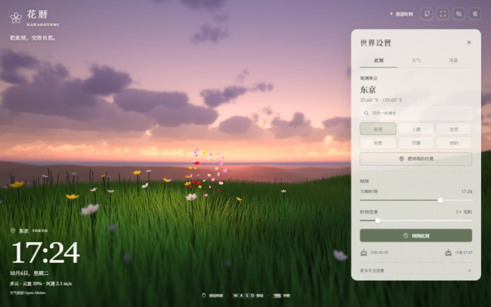
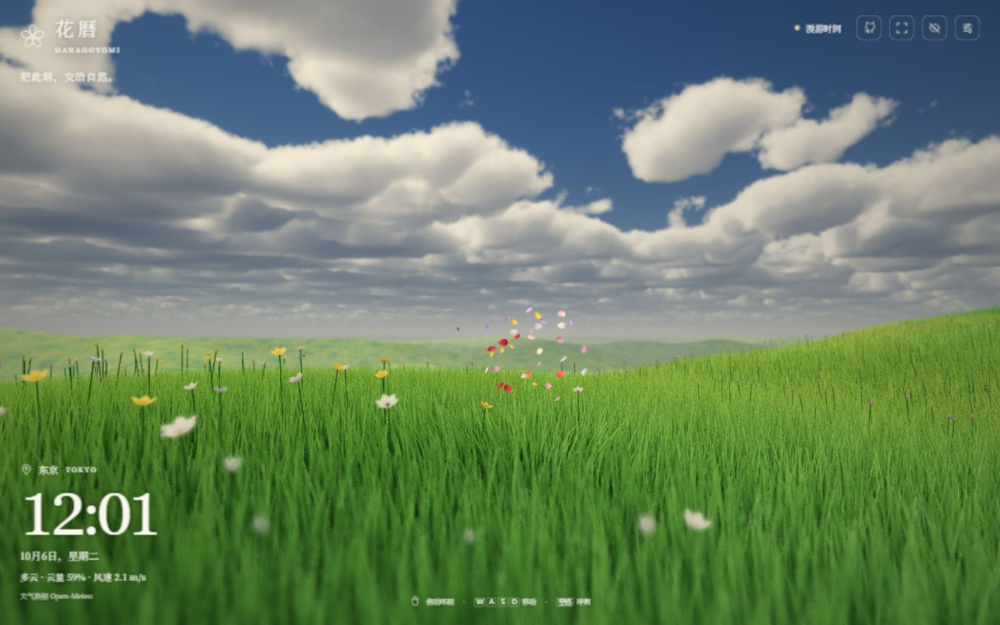
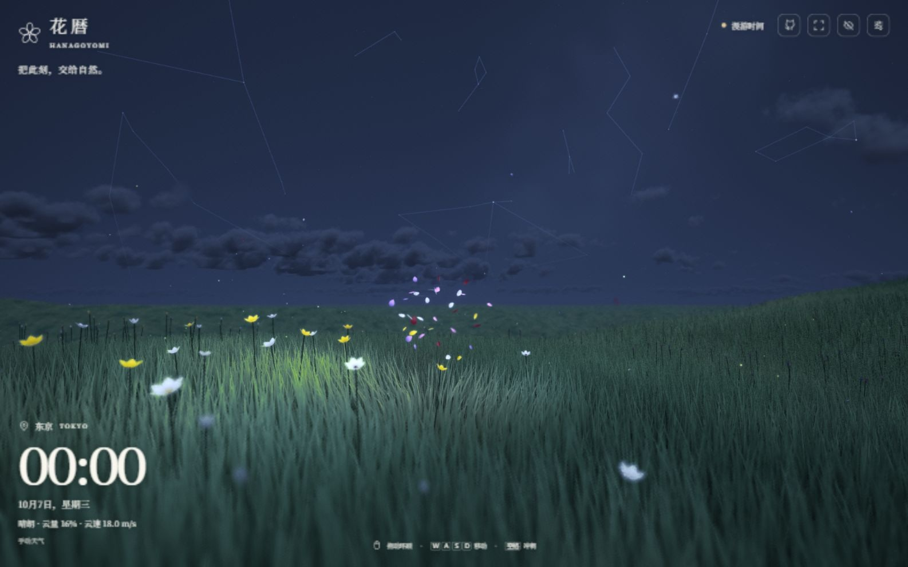
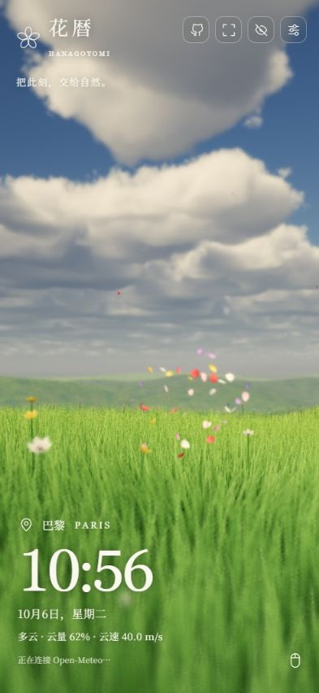

[English](README.md) · [简体中文](README.zh-CN.md)

<div align="center">


# 花暦 · Hanagoyomi

**Give this moment to nature.**

Step into a changing natural world of clouds, meadows and petals, following real places, local time and weather.

[**Try it live ↗**](https://hanagoyomi.luyilabs.com/) · [Technical reference](docs/TECHNICAL.md) · [Run locally](#run-locally) · [Contributing](CONTRIBUTING.md)

[](LICENSE)
[](https://github.com/tadazly/hanagoyomi/actions/workflows/ci.yml)


[](https://open-meteo.com/)

</div>

<a href="https://hanagoyomi.luyilabs.com/"></a>

> The image shows the actual browser rendering. The meadow and flowers are procedural; the sky follows the selected location's astronomical position and current weather. The terrain does not reproduce that city's geography. Screenshots may show the Chinese interface; English and Japanese are also available.

## A world that changes

| Part of the world | How it changes |
| --- | --- |
| **Here and now** | Choose a city or use geolocation. Local time follows the location's IANA time zone, with calculated sun and moon positions, sunrise, sunset and lunar phases. |
| **A moving sky** | Volumetric clouds, sunlight scattering, day and night palettes, about 5,000 catalog stars, constellation lines and five planets. |
| **Weather taking shape** | Current weather, cloud cover and wind from Open-Meteo, plus 16 explorable weather presets from clear skies to thunderstorms, sleet and blizzards. |
| **Where the wind passes** | Grass with multiple LOD levels, rolling waves, floating petals, opening flowers, fireflies and optional memory of flowers along your path. |
| **A quiet interface** | Location and clock observations, four settings tabs, customizable component visibility and positions, fullscreen and immersive modes, adapted for desktop and touch. |
| **Three languages** | Simplified Chinese, Japanese and English, selected automatically from browser preferences and time zone or changed manually. |

<table>
  <tr>
    <td width="50%"></td>
    <td width="50%"></td>
  </tr>
  <tr><td align="center">Day · Wind and petals</td><td align="center">Night · Stars and fireflies</td></tr>
</table>

<details>
<summary>Hanagoyomi on a touch screen</summary>
<p align="center"></p>
On the first visit, mobile settings are collapsed. Tap the settings button in the top right to open the bottom panel. This screenshot uses a simulated mobile browser viewport.
</details>

## Run locally

Requires **Node.js 22.12+** and a browser with **WebGL2 and floating-point render targets**. No backend or API key is needed.

```bash
git clone https://github.com/tadazly/hanagoyomi.git
cd hanagoyomi
npm ci
npm run dev
```

Open the `http://127.0.0.1:5173/` URL printed in the terminal. The modular application must run over HTTP.

```bash
npm test          # Clock, astronomy, weather and i18n tests
npm run build     # Build the static site into dist/
npm run preview   # Preview the production build at http://127.0.0.1:4173/
```

## Explore

| Input | Action |
| --- | --- |
| Move the mouse during auto flight | Steer left / right and climb / dive; return to the screen centre for neutral, without holding a button |
| Double-click left | Dash |
| Double-click right | Turn around (briefly waits to distinguish a triple-click) |
| Triple-click right | Pause / Resume flight |
| Drag left while flight is paused | Look around |
| WASD / Arrow keys | Move forward, backward and sideways |
| Q / E | Descend / Ascend |
| Shift / Space | Accelerate / Dash |
| Scroll wheel | Adjust field of view |
| F / H / Esc | Fullscreen / Immersive mode / Return to the interface |
| Swipe with one finger | Steer the petal stream like a flight joystick |
| Double-tap with one / two / three fingers | Dash / Turn around / Pause or resume flight |

Settings stay in the current browser. Moving the time slider or changing its speed enters simulated time; **Back to now** restores real local time. Weather continues to follow current observations, so changing the simulated clock does not retrieve historical weather.

On desktop, click the toolbar's time status to open a compact time panel. It shares its controls with World settings. Constellation lines and orientation are under **Landscape → Astronomy**.

In **World settings → Components**, show or hide the LOGO, time and weather, and controls hint independently. Only time and weather offer nine screen positions or an adaptive default, with room kept for the LOGO, hint, and toolbar. The LOGO and hint keep their adaptive positions. Preferences stay in the current browser.

Weather display options and **Open world settings on startup** are also under **Components**. The startup option becomes available after choosing an observation location and is off by default. Controls help remains accessible here when the hint is hidden.

Turn off **Components → Scene interaction** to disable mouse, keyboard, wheel, and touch controls and hide the hint. **Landscape → Camera → Auto flight** remains independent: it continues flying when enabled, and turning it off as well locks the camera position, orientation, and field of view. Settings remain usable; enabling interaction restores the saved hint preference. This switch stays saved in the current browser.

In immersive mode, **Show interface** hides after four seconds. Move the pointer to the bottom-right corner or tap that corner to reveal it. It stays visible while the pointer is nearby and hides four seconds after leaving. **Tab** can also reveal the button; **Esc** returns to the interface.

## Interface language

The interface supports Simplified Chinese, Japanese and English. On first load, language selection follows this order:

1. A manual choice saved in the current browser.
2. The first supported language in the browser's preference list (`navigator.languages`, falling back to `navigator.language`). All Chinese locale tags use Simplified Chinese.
3. The browser's system time zone (`Intl.DateTimeFormat().resolvedOptions().timeZone`): Japanese for Japan; Simplified Chinese for mainland China, Hong Kong, Macau and Taiwan.
4. English when the available signals cannot be read, recognized or matched.

Change **World settings → Language** to update the interface immediately without reloading. Choose **Automatic** to restore detection. City search accepts Chinese, Japanese and English names. Language detection requests no geolocation permission and sends neither language nor time zone to external services.

## Where to start reading

```text
src/
├── main.js                  # Application entry
├── data/                    # Cities, stars and constellations
├── i18n/                    # Translations, language detection and UI updates
├── world/                   # Zoned clock, sun and moon, weather and presets
├── rendering/               # WebGL2 orchestration, GLSL and shared CPU/GPU terrain
├── ui/                      # Observations, interaction and SVG icons
└── styles/                  # Design tokens, layout and controls
tests/                       # Core regression tests
docs/                        # Technical and design references
```

The following project guides are currently in Chinese:

- [Technical reference and further reading](docs/TECHNICAL.md): rendering pipeline, clouds, lighting, grass LOD, astronomy, weather and performance limits.
- [Design notes](docs/DESIGN.md): visual theme, design tokens, responsive layout and accessible interactions.
- [Contributing](CONTRIBUTING.md): development checks and visual acceptance guidance.
- [Third-party notices](THIRD_PARTY_NOTICES.md): attribution for star data, weather and algorithms.

## Data and usage limits

Open-Meteo's current weather comes from weather model data and is requested every 15 minutes. If the request fails, the interface explicitly shows **Dynamic weather** and keeps running; you can retry manually. Clouds, precipitation intensity, puddles, snow cover and nighttime lighting use artistic approximations. This is a nature experience, not a meteorological or astronomical measurement tool.

Geolocation runs only after you click **Use my location** and the browser permits it. Coordinates are sent to Open-Meteo to request weather. The project has no user database or analytics tracking; browser settings and bloom memory stay local.

Desktop rendering and simulated mobile screenshots do not guarantee performance on every phone GPU. Lower quality on slower devices; quality is automatically reduced when no manual choice has been made. Safari, Firefox and physical phones still need ongoing compatibility testing.

## Acknowledgments and license

Inspired by thatgamecompany's *Flower*. This project is not affiliated with the game or its team. Algorithm references are in the [technical guide](docs/TECHNICAL.md#延伸阅读), star data comes from [d3-celestial](https://github.com/ofrohn/d3-celestial), and weather is provided by [Open-Meteo](https://open-meteo.com/).

Project code is available under the [MIT License](LICENSE). Third-party data and services retain their own terms. The MIT License does not change the non-commercial conditions of Open-Meteo's free API or its weather data attribution requirements; see the [third-party notices](THIRD_PARTY_NOTICES.md).
