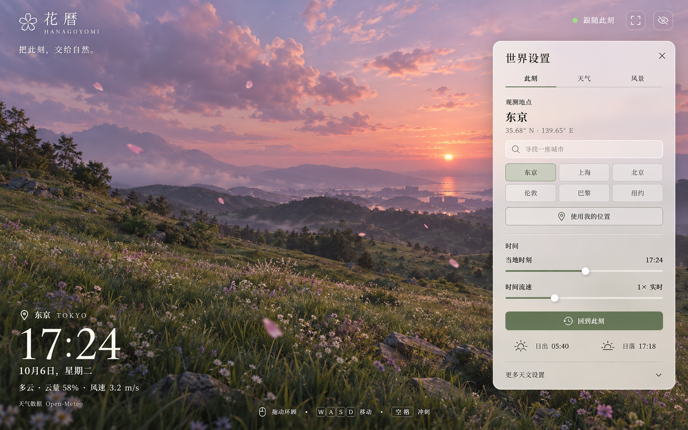

# 花暦的视觉与交互

花暦是一页可漫游的自然世界。界面只承担观测、改变地点与调节世界的职责，让大部分视野留给云、草和花瓣。

## 主题

品牌使用「花暦 · Hanagoyomi」和「把此刻，交给自然。」。五瓣花标志、中文衬线字和细线图标组成一个克制的自然观测界面。默认在画面左下角展示地点、当地时钟、日期和天气；右侧设置分为“此刻”“天气”“风景”“组件”。

## 设计基准

概念图由 Image Gen 生成，原生尺寸为 1586 × 992。它定义界面构图、文字层级、磨砂面板、控件和颜色；概念中的山地照片只用于说明空间感。产品使用原有实时 WebGL2 草原，不将概念图作为静态背景。品牌标志及图标使用可缩放的代码原生 SVG。

| 令牌 | 取值与用途 |
| --- | --- |
| 正文 | `#262a23`，面板主要文字 |
| 次要文字 | `#666a60`，坐标与辅助信息 |
| 强调色 | `#65745b`，选中状态、滑轨、主要按钮 |
| 面板 | `rgba(245, 242, 237, .87)`，暖灰色半透明表面 |
| 轮廓 | 低对比细线，20 px 面板圆角、7 px 控件圆角 |
| 字体 | 系统中文衬线字体；数字时钟使用 Georgia；不需要外部字体请求 |
| 间距 | 32 px 画面边距、28 px 面板内边距，移动端缩小外边距 |

## 布局与状态

桌面默认打开设置，手机默认收起设置。手机面板从底部展开，内容在面板内滚动；展开时隐藏背后的观测信息，避免时钟遮挡控件。safe-area 避让系统区域。观测信息不使用额外背景卡片。顶部与观测文字使用浅色及柔和阴影，以适应不断变化的天空。

设置页签支持左右方向键、Home 和 End，选中页签与可见面板状态同步。滑块和开关保留浏览器键盘操作。天气数据失败时展示动态来源；模拟时刻显示“漫游时间”或“时间静止”。沉浸模式可通过“返回界面”或 Esc 退出。

组件页提供 LOGO、时间天气和操作提示的独立显示开关，仅时间天气提供九宫格位置选择。LOGO 和操作提示保持原有自适应位置；时间天气避开这些固定组件与工具栏。天气字段显示与启动时展开设置的选项集中于此；隐藏操作提示后仍可从组件页查看操作说明。布局和可见性保存在当前浏览器。

自动飞行时，鼠标以画面中心为摇杆中立点，复用触屏的转向、升降、侧倾和花瓣跟随逻辑。左键双击冲刺，右键双击掉头，右键三击暂停或继续；双击右键等待 400 ms 以区分第三击。暂停飞行时左键拖动环顾，鼠标移到界面控件或离开窗口时停止操纵。

在概念基准上新增的 GitHub 按钮来自用户要求；全屏、帮助、触屏说明和完整高级控件是原有功能的可用性整理。所有数值来自运行状态，不把概念图中的示例天气或日出时刻写死。

## 验收方法

在与概念同尺寸的桌面和至少一个移动视口中，检查品牌、抽屉尺寸、字号、控件间距、颜色、图标、观测区、文字裁切和滚动。分别验证白昼、夜晚、真实天气、手动天气、收起面板、沉浸模式及其恢复。

减少动态效果偏好会关闭首次启动时的自动飞行和镜头运动；用户已有的明确设置优先。自然渲染动画仍持续运行。

## 首版对照记录

使用 Codex 内置浏览器在 1586 × 992 原生概念尺寸、393 × 852 和 320 × 740 视口验收，并查看概念图与实际截图。

| 对照点 | 实现与核对 |
| --- | --- |
| 品牌与文字 | 五瓣花、花暦、HANAGOYOMI 和主文案保持构图；中文系统衬线字体与概念风格一致，具体字形随设备变化。 |
| 面板构图 | 修正初版面板过窄的问题；原生尺寸下使用约 420 px 宽、32 px 外边距、20 px 圆角。 |
| 控件与排版 | 三页签、两行城市按钮、两个时间滑块、回到此刻和日出日落保留顺序；调整字号和内边距。 |
| 颜色与图标 | 暖灰磨砂表面、鼠尾草绿强调色、细线 SVG；真实天空透过面板，数值由状态提供。 |
| 观测信息 | 无背景卡片的地点、96 px 衬线时钟、日期、天气和来源，布局与概念一致。 |
| 移动布局 | 默认收起，底部面板可滚动；修复时钟叠到控件的问题，320 px 视口无水平溢出或品牌/工具栏重叠。 |
| 文字差异 | 保留概念界面文案；新增 GitHub 入口来自用户要求，天气、时钟和日出数值按数据变化。 |

刻意差异：自然背景继续使用原有 WebGL2 草原，具体云形、花朵、时间和天气不会与概念图逐像素一致。Github/帮助与完整高级设置承担实际功能，不属于新增营销内容。
