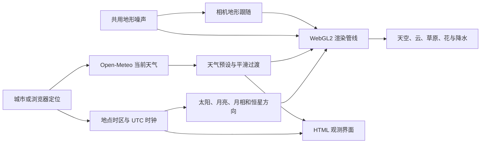

# 花暦技术参考

这份文档按当前源码整理自然世界的实现方式，便于学习、复用和继续改进。项目使用原生 JavaScript ES Modules 与 WebGL2，Vite 负责开发服务和静态构建，不依赖通用三维引擎。

## 模块与数据流



| 文件 | 阅读重点 |
| --- | --- |
| [`world/clock.js`](../src/world/clock.js) | UTC 与地点时区转换，真实时间与模拟时间的边界 |
| [`world/astronomy.js`](../src/world/astronomy.js) | 低精度天体位置、月相与日出日落 |
| [`world/weather.js`](../src/world/weather.js) | 天气 API、字段验证、WMO 代码 |
| [`world/weather-presets.js`](../src/world/weather-presets.js) | 16 种天气参数及动态天气转移权重 |
| [`rendering/terrain.js`](../src/rendering/terrain.js) | CPU 与 GPU 共用的地形噪声 |
| [`rendering/shaders.js`](../src/rendering/shaders.js) | GLSL 的云、天空、草、花、降水与后处理 |
| [`rendering/world.js`](../src/rendering/world.js) | 图形资源、模拟状态、输入与逐帧调度 |
| [`ui/shell.js`](../src/ui/shell.js) | 界面状态、观测信息、全屏与沉浸模式 |

`world.js` 保留完整渲染调度以减少原始效果迁移风险，后续可逐步分离 GL 资源管理、相机和天气模拟。CPU/GPU 同名参数应保持一致。

## 1. 时间与天文

### 同一时刻，不同地点

内部使用 UTC 毫秒。城市包含经纬度与 IANA 时区，使用 `Intl.DateTimeFormat` 计算地点偏移，不根据经度简单猜测时区。时区偏移按分钟缓存，夏令时仍按对应日期转换。

真实模式每帧读取 `Date.now()`，避免标签页进入后台后因为动画帧被限速而落后。模拟模式根据单调时钟的完整帧间隔推进，移动和物理效果单独限制 `dt`，避免恢复页面时相机突然飞出。

```js
simMs = followNow && speed === 1
  ? Date.now()
  : simMs + elapsedMs * speed;
```

调整当地时刻时，用目标时刻的时区偏移转换回 UTC。夏令时跳过的时刻会归一化到相邻有效时刻；重复时刻没有提供两次时刻的独立选择。测试包含夏令时变化日和半小时偏移地区。

### 天体方向与日出日落

太阳和月亮采用低精度黄道坐标近似，经赤道坐标与地方恒星时转换为地平高度和方位。太阳方向决定云、草与地面的主要光照；月相来自日月黄经差。夜晚的月光和环境光经过艺术化增强，让暗处仍可观赏。

日出日落以太阳高度 `-0.833°` 为阈值，在当地一天内按约 10 分钟采样并插值求交点；同时识别极昼、极夜。当地日的长度允许 23 或 25 小时。它不是高精度星历，也未加入建筑遮挡、真实山地地平线和精密大气折射修正。

5,044 颗恒星及 1,486 个星座线顶点以紧凑 Base64 二进制保存，解析为位置、星等与色指数。星空随地方恒星时旋转，云透射率用于遮挡星光。行星使用 JPL 的近似轨道元素，源代码参数对应 1800–2050 年范围；不宜用于精密观测。[JPL 原始资料](https://ssd.jpl.nasa.gov/planets/approx_pos.html)

## 2. 体积云与大气

### 云的密度

启动时生成 `128³` 形状噪声、`64³` 细节噪声和 `512²` 天气纹理。Perlin 与 Worley 噪声提供团块和侵蚀细节，再结合云层高度、云量和密度塑形。生成任务分帧执行，界面显示进度。

视线与球形云层相交后沿射线步进。每步根据密度估算消光、光照透射与散射；透射率足够低时提前结束。Beer–Lambert 形式可概括为：

```text
T_segment = exp(-extinction * density * distance)
L_accum  += T_accum * L_scatter * (1 - T_segment)
T_accum  *= T_segment
```

云使用前向与后向 Henyey–Greenstein 相函数混合、多级散射近似，以及顶部天空光、底部地面反照与云内遮蔽。它是实时观赏方案，不是完整的多次散射物理求解。[Frostbite 课程入口](https://sebh.github.io/publications/)、[Guerrilla 体积云分享](https://www.guerrilla-games.com/read/the-real-time-volumetric-cloudscapes-of-horizon-zero-dawn)

### 低分辨率与历史累积

云缓冲以 CSS 视口为基准，比例随画质变化，并设置约 115 万像素的上限。云颜色保存在浮点纹理中，同时输出云深度。TAA 根据云深度、相机位移和上一帧视锥重投影历史；用 3×3 邻域均值、方差和范围限制历史值，以减轻拖影。转向、光照变化和闪电时提高当前帧权重，尺寸变化时重置历史。

大气部分计算 Rayleigh、Mie 与臭氧消光，使用小型天空 LUT 避免每个场景像素都执行完整积分；另外近似多重散射，让日落后高空仍保留颜色。

## 3. 草原、风与花瓣

### 同一片地形

地形由五组尺度、方向和振幅不同的噪声叠加。CPU 高度采样和 GLSL 使用相同纹理及参数。CPU 负责相机高度、前方坡地预采样和花瓣路径；GPU 将地形、草和花放到同一地表。修改其中一侧而未同步另一侧，会造成穿地或悬浮。

近景草使用实例化几何草叶，多级网格按距离改变密度与草叶段数；中景草层与远景地形保持一致的颜色和光照。网格在相机附近循环复用，并按视锥裁剪。风由大尺度风浪、局部噪声和草叶弯曲组成，避免每根草独立随机摆动。

### 花瓣流与触地记忆

花瓣读取带时间戳的路径历史，再按固定时间延迟插值，减少不同帧率带来的间距变化。花瓣触地会推动草和触发花苞绽放。有限记忆保存在相机附近的纹理中；无限记忆在 CPU 中按空间格子索引路径点并保存到浏览器，重回区域后重新盖章。路径点有数量上限，不能承诺无限存储。

萤火虫使用实例化点精灵，亮度包含呼吸和闪烁节奏；夜间花朵光照写入小范围光场纹理，再由地表采样。镜头追随前导花瓣，带惯性、转弯倾斜和地形跟随。

## 4. 天气与地表变化

天气请求获取当前 `temperature_2m`、`precipitation`、`weather_code`、`cloud_cover`、`wind_speed_10m` 和 `wind_direction_10m`，明确使用摄氏度、毫米和 m/s。温度在显示时换算为用户选择的单位，默认摄氏度，选择保存在现有设置记录中；降水量注明 `current.interval` 对应的累计时段。WMO 代码选择预设，实际云量和风速继续修正场景。Open-Meteo 的当前状态来自天气模型，不能理解为每个地点的逐秒现场传感器读数。[API 文档](https://open-meteo.com/en/docs)

每次请求有 8 秒超时、HTTP/字段/数值校验及请求序号保护。用户切换城市或模式后，旧请求不能覆盖新状态。每 15 分钟刷新；恢复标签页时若数据过期会重取。失败时撤销真实数据标记，继续动态天气并在界面说明来源。

空气质量通过独立请求获取 Open-Meteo / CAMS 的当前 `us_aqi`，采用美国 AQI 分级，保留来源署名。该请求具有独立超时和同一套地点、模式、请求序号保护；失败只清空空气质量，不影响有效天气。跟随天气时缺失指标显示“—”，不把缺失值当作零降水或良好空气。手动、动态及关闭天气效果模式隐藏无法获取的温度、降水量和空气质量，主界面与设置面板使用相同规则；切回跟随天气后按数据和用户显示偏好恢复。[空气质量 API 文档](https://open-meteo.com/en/docs/air-quality-api)

主界面将天气状况与温度放在同一行，其余指标采用可换行的简短条目，累计时段和 AQI 标准通过提示及设置提供。`showWeather` 控制整组显示，`showTemperature`、`showPrecipitation`、`showAirQuality`、`showClouds`、`showWind` 分别控制条目，均沿用 `meadow.settings.v1` 保存；降水量、空气质量、云量和风速默认隐藏。这些开关只控制主界面信息，不改变场景天气或 API 请求。

组件页统一管理 LOGO、时间天气与操作提示的可见性，以及天气字段显示开关。只有时间天气允许选择九宫格位置，LOGO 与操作提示保持固定的自适应位置。`component-settings.js` 校验并保存 `hanagoyomi.components.v1`，按锚点和实际尺寸布局，通过 `ResizeObserver` 响应文字、天气字段及屏幕尺寸变化；时间天气避让固定组件与工具栏。布局不依赖 WebGL 状态。

动态天气使用带权重的转移图，并根据季节与时间调整。天气参数连续混合，地面湿度和积雪拥有自己的积累、蒸发或融化过程，因此刚停止下雨时地面不会立刻变干。模拟时钟不会请求历史天气；时间流速对动态天气速度有单独上限。

降水与雨后效果分为多层：

- 雨丝和雪粒子根据画质调整实例数，结合地形和深度遮挡。
- 积水使用地形低洼程度与多尺度噪声定义形状，加入反射和雨滴涟漪。
- 地表湿润改变颜色和反光，积雪按覆盖率逐步叠加。
- 镜头雨滴使用粒子模拟，包含滑落、合并和拖尾；生成水面坡度纹理，用于最终画面的折射扰动。
- 闪电生成分叉线段与多次脉冲，并影响云和地表照明。

这些效果以观赏为目的。降雨、积水和积雪参数不是现实降水毫米数、水文过程或实际雪深。[雨天世界的原始技术文章](https://seblagarde.wordpress.com/2012/12/10/observe-rainy-world/)

## 5. 后处理与性能

渲染顺序大致为天空 LUT / 云阴影 → 云步进 → 云 TAA → 天空与地形、草花、天体及降水 → 景深 → Bloom 金字塔 → 调色、显示变换和镜头水滴。场景使用 MSAA，后处理使用若干半分辨率目标；所有渲染目标在重建时释放。

| 档位 | 云缓冲比例 | 云步数 | 草叶分段（近 / 中 / 远） | DPR 上限 |
| --- | ---: | ---: | --- | ---: |
| 低 | 0.45 | 40 | 4 / 2 / 1 | 1.5 |
| 中 | 0.60 | 56 | 4 / 2 / 1 | 2.0 |
| 高 | 0.70 | 80 | 4 / 2 / 1 | 2.0 |
| 极高 | 0.90 | 110 | 4 / 2 / 1 | 2.5 |

画质还影响网格密度、花瓣数量、降水粒子、景深样本和 Bloom 层级。未手动选档时，运行采样会尝试降低档位；UI 的 FPS 是帧回调统计，不能当作精确 GPU 渲染时间。

在性能排查中，应同时记录浏览器、GPU、视口、DPR、画质、天气和镜头高度。构建通过不代表图形可用；移动视口通过不代表实体手机性能。首轮验收以桌面 Chromium 实际 WebGL2 和移动布局仿真为主，其他浏览器与设备需单独验证。

## 延伸阅读

以下是算法与工程思路的原始资料入口，并不表示花暦实现了其中全部技术。

1. [Sébastien Hillaire：Frostbite 与大气渲染论文 / 课程目录](https://sebh.github.io/publications/)。理解大气积分、查找表和云光照。
2. [Guerrilla：The Real-Time Volumetric Cloudscapes of Horizon Zero Dawn](https://www.guerrilla-games.com/read/the-real-time-volumetric-cloudscapes-of-horizon-zero-dawn)。理解实时云的形状、光照与性能取舍。
3. [Sébastien Lagarde：Water drop 1 — Observe rainy world](https://seblagarde.wordpress.com/2012/12/10/observe-rainy-world/)。从现实雨景观察湿表面、积水与反射。
4. [SunCalc](https://github.com/mourner/suncalc)。太阳和月亮位置的轻量天文算法参考，采用 MIT License。
5. [JPL：Approximate Positions of the Planets](https://ssd.jpl.nasa.gov/planets/approx_pos.html)。近似轨道元素、求解方法和有效年代。
6. [F. J. Ballesteros：New insights into black bodies](https://arxiv.org/abs/1201.1809)。B−V 色指数与恒星温度的参考。
7. [d3-celestial](https://github.com/ofrohn/d3-celestial)。星表与星座数据来源，保留其 BSD 许可。
8. [Open-Meteo 文档](https://open-meteo.com/en/docs)。天气字段、单位、WMO 解释和数据使用要求。

引用论文时请查阅原文，复用数据和代码时请同时保留 [第三方声明](../THIRD_PARTY_NOTICES.md)。
